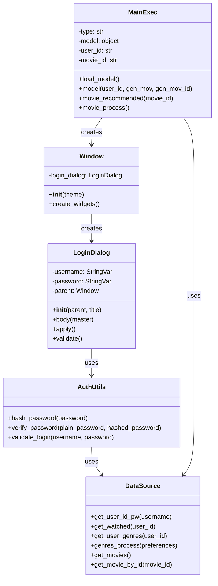
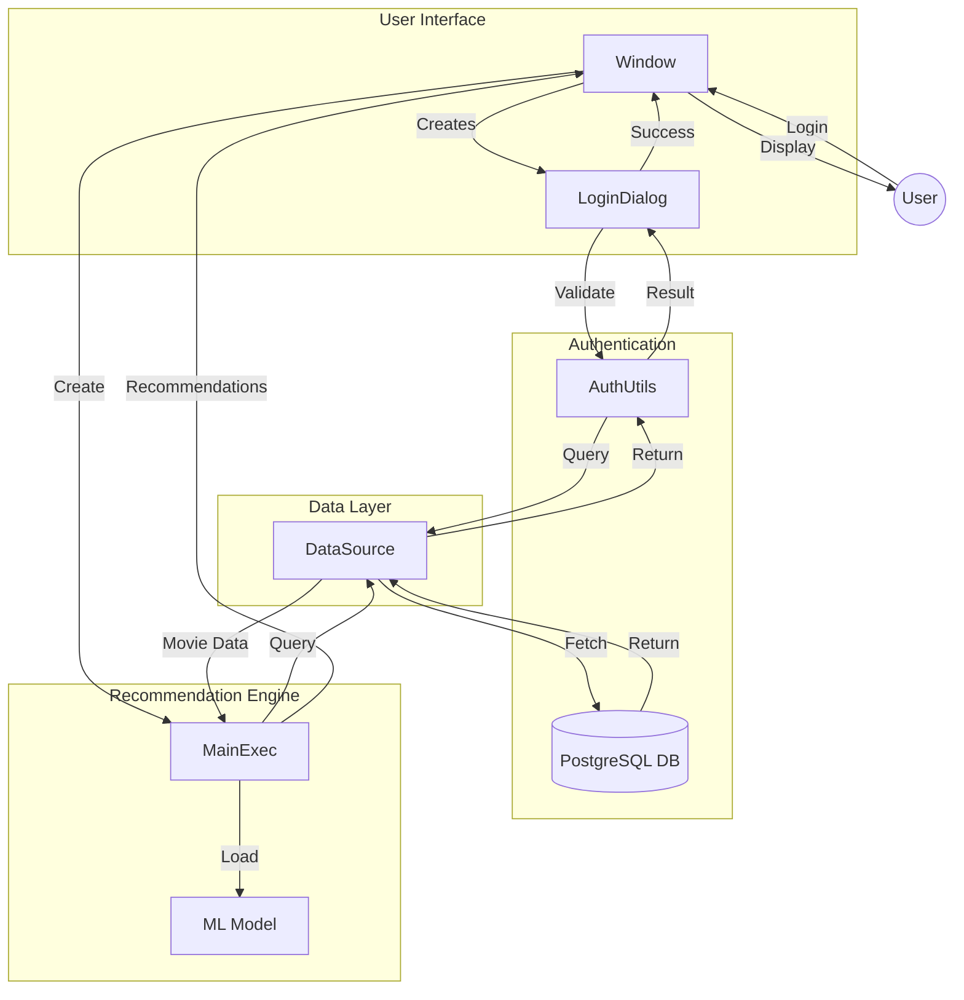

# System Architecture

## Class Diagram

## Data Flow Diagram

## Component Descriptions

### User Interface Layer
- **Window**: Main application window using tkinter
- **LoginDialog**: Handles user authentication UI

### Authentication Layer
- **AuthUtils**: Manages password hashing and verification
- **Database**: Stores user credentials and movie data

### Recommendation Engine
- **MainExec**: Core recommendation logic
- **ML Model**: Machine learning model for recommendations

### Data Layer
- **DataSource**: Database access and data processing

## Data Flow Process

1. **Login Flow**:
   - User enters credentials
   - LoginDialog passes to AuthUtils
   - AuthUtils verifies with DataSource
   - DataSource queries PostgreSQL
   - Result flows back to UI

2. **Recommendation Flow**:
   - MainExec loads ML model
   - Queries user preferences via DataSource
   - Processes recommendations
   - Returns results to Window
   - Window displays to user

## Security Features
- Passwords are hashed using bcrypt
- Salt is automatically generated per password
- No plain text passwords stored in database
